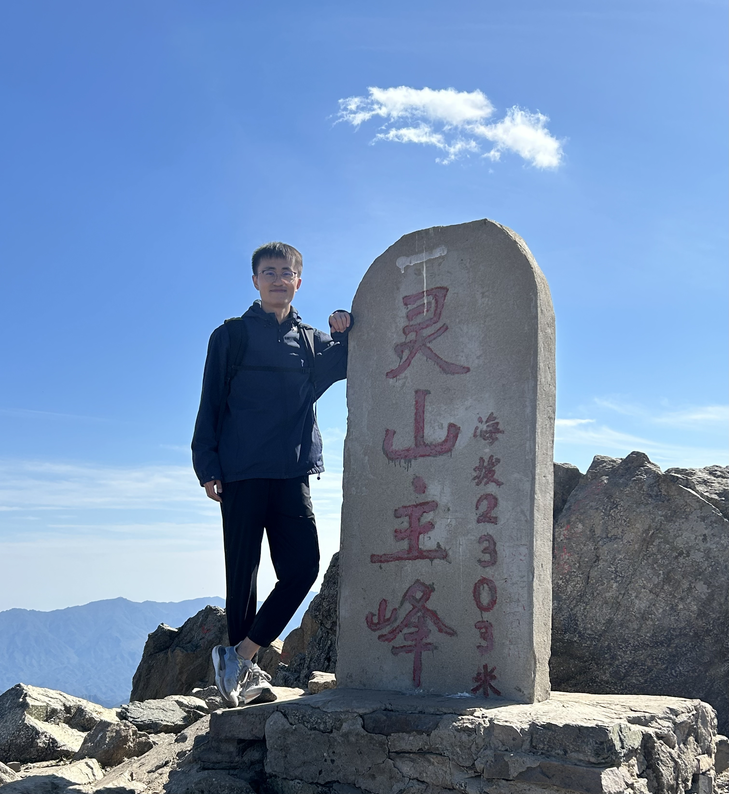

# About Me

I'm a research engineer in Huawei Cloud with a focus on serverless, cloud native and distributed systems. I'm also interested in the advancement of AI infra and LLMs.  

I received the joint Ph.D. degree in industrial engineering with the Department of System Engineering, City University of Hong Kong, Hong Kong, and also in management science and engineering with the School of Economics and Management, University of Chinese Academy of Sciences, China, in 2021. Before that I received the B.S. degree in mathematics and the B.E. double degree in ecomomics from the Huazhong University of Science and Technology (HUST), Wuhan, China, in 2016.

# Ph.D. Thesis
Data-driven Methods for System Reliability Analysis and Maintenance Optimization
[Link](https://scholars.cityu.edu.hk/en/theses/theses(3b3b864d-a669-4e00-9acd-36db594fb949).html), [PDF](http://lbapp01.lib.cityu.edu.hk/capcheck/check.php?url=http://lbms03.cityu.edu.hk/theses/c_ftt/phd-adse-80267954.pdf)

# Publications
Xiaoyan Zhu, Ping Zhang, & Xie, M. (2021). A Joint Long Short-Term Memory and AdaBoost regression approach with application to remaining useful life estimation. Measurement, 170, 108707.

Zhang, P., Zhu, X., & Xie, M. (2021). A model-based reinforcement learning approach for maintenance optimization of degrading systems in a large state space. Computers & Industrial Engineering, 161, 107622.

Zhang, P., Xie, M., & Zhu, X. (2021). Exploiting structural similarity in network reliability analysis using graph learning. Proceedings of the Institution of Mechanical Engineers, Part O: Journal of Risk and Reliability, 235(6), 1057-1071.

Zhang, P., & Zhu, X. (2018, December). Spectral Graph Wavelet based Component Clustering for System Reliability Analysis. In 2018 IEEE International Conference on Industrial Engineering and Engineering Management (IEEM) (pp. 1135-1139). IEEE.

Zhu, X., Lu, C., & Zhang, P. (2023). Classification-based Framework for Remaining Useful Life Prediction with Limited Images and Unequal Time Intervals. IEEE Transactions on Instrumentation and Measurement.

Qingyuan Liu, Dong Du, Yubin Xia, Ping Zhang (2023). [The Gap Between Serverless Research and Real-world Systems](https://acmsocc.org/2023/accepted-papers.html), ACM Symposium on Cloud Computing.

Zhang, P., et al. [FinOps in Serverless: Economical Serverless](https://medium.com/@pingzhang8-c/finops-in-serverless-economical-serverless-9221fbc8e9ae), Medium.

Zhang, P., et al. [Serverless Upgrading in All Domains: Huawei Cloud Proposes Seven Serverless Microservice Practice Standards](https://medium.com/@pingzhang8-c/serverless-upgrading-in-all-domains-huawei-cloud-proposes-seven-serverless-microservice-practice-c2c4bb328a8b), Medium.

Zhang, P., et al. [Huawei Cloud and Shanghai Jiao Tong University Jointly Released OSBI and ServerlessBench 2.0](https://medium.com/@pingzhang8-c/huawei-cloud-and-shanghai-jiao-tong-university-jointly-released-osbi-and-serverlessbench-2-0-a42b7ae868d4), Medium.

# Patents

# 
