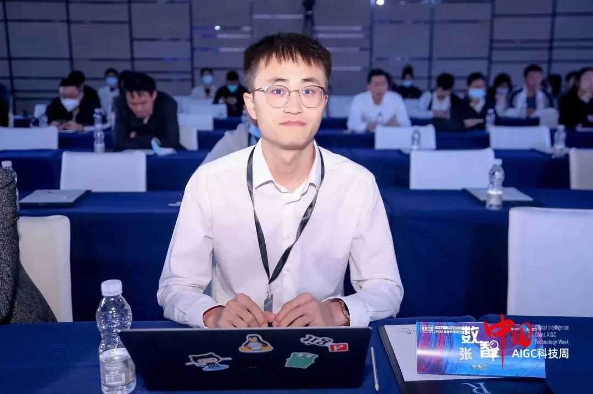

# Ping Zhang's Homepage

I'm a research engineer in Huawei Cloud with a focus on serverless, cloud native and distributed systems. I'm also interested in the advancement of AI infra and LLMs.  

I received the joint Ph.D. degree in industrial engineering, supervised by [Prof. Min Xie](https://www.cityu.edu.hk/sye/minxie.htm), City University of Hong Kong, Hong Kong, and also in management science, supervised by [Prof. Xiaoyan Zhu](https://people.ucas.ac.cn/~0032929), University of Chinese Academy of Sciences, China, in 2021. 

Before that I received the B.S. degree in mathematics and the B.E. double degree in ecomomics from the Huazhong University of Science and Technology (HUST), Wuhan, China, in 2016.

# Ph.D. Thesis
Data-driven Methods for System Reliability Analysis and Maintenance Optimization
[Link](https://scholars.cityu.edu.hk/en/theses/theses(3b3b864d-a669-4e00-9acd-36db594fb949).html), [PDF](http://lbapp01.lib.cityu.edu.hk/capcheck/check.php?url=http://lbms03.cityu.edu.hk/theses/c_ftt/phd-adse-80267954.pdf)

# Publications
Xiaoyan Zhu, Ping Zhang, & Xie, M. (2021). [A Joint Long Short-Term Memory and AdaBoost regression approach with application to remaining useful life estimation](https://www.sciencedirect.com/science/article/abs/pii/S0263224120312148). Measurement, 170, 108707.

Zhang, P., Zhu, X., & Xie, M. (2021). [A model-based reinforcement learning approach for maintenance optimization of degrading systems in a large state space](https://www.sciencedirect.com/science/article/abs/pii/S036083522100526X). Computers & Industrial Engineering, 161, 107622.

Zhang, P., Xie, M., & Zhu, X. (2021). [Exploiting structural similarity in network reliability analysis using graph learning](https://journals.sagepub.com/doi/abs/10.1177/1748006X211009329?journalCode=pioa). Proceedings of the Institution of Mechanical Engineers, Part O: Journal of Risk and Reliability, 235(6), 1057-1071.

Zhang, P., & Zhu, X. (2018, December). [Spectral Graph Wavelet based Component Clustering for System Reliability Analysis](https://ieeexplore.ieee.org/document/8607637). In 2018 IEEE International Conference on Industrial Engineering and Engineering Management (IEEM) (pp. 1135-1139). IEEE.

Zhu, X., Lu, C., & Zhang, P. (2023). [Classification-based Framework for Remaining Useful Life Prediction with Limited Images and Unequal Time Intervals](https://ieeexplore.ieee.org/document/10224272). IEEE Transactions on Instrumentation and Measurement.

Qingyuan Liu, Dong Du, Yubin Xia, Ping Zhang (2023). [The Gap Between Serverless Research and Real-world Systems](https://acmsocc.org/2023/accepted-papers.html), ACM Symposium on Cloud Computing.

Zhang, P., et al. [FinOps in Serverless: Economical Serverless](https://medium.com/@pingzhang8-c/finops-in-serverless-economical-serverless-9221fbc8e9ae), Medium.

Zhang, P., et al. [Serverless Upgrading in All Domains: Huawei Cloud Proposes Seven Serverless Microservice Practice Standards](https://medium.com/@pingzhang8-c/serverless-upgrading-in-all-domains-huawei-cloud-proposes-seven-serverless-microservice-practice-c2c4bb328a8b), Medium.

Zhang, P., et al. [Huawei Cloud and Shanghai Jiao Tong University Jointly Released OSBI and ServerlessBench 2.0](https://medium.com/@pingzhang8-c/huawei-cloud-and-shanghai-jiao-tong-university-jointly-released-osbi-and-serverlessbench-2-0-a42b7ae868d4), Medium.

# Honours
The Pacemaker to Merit Student, University of Chinese Academy of Sciences, 3%.

Joint PhD Fellowship, City University of Hong Kong.

Freshman Scholarship, University of Chinese Academy of Sciences, 5%.

Model Graduate, Huazhong University of Science and Technology.

Second Prize of the Seventh National Mathematic Contest, Group of Mathematics, China

National Encouragement Scholarship, Huazhong University of Science and Technology.

# Personal Leads
Nov. 2016 – Jan. 2019. Workshop on The Frontiers of Machine and Deep Learning. 

I initiated this special interest group and had run it for two years. Workshop Homepage: https://beijingbrainstorming.weebly.com/

Sep. 2013 – Nov. 2014. Host of the Project Management Depart..

In the South Fuji Train Before Career Club, Huazhong University of Science and Technology.

# Talks
May. 2019. Reinforcement learning approach for condition based maintenance of degrad- ing systems, The 13th PhD Student Workshop 2019.

Nov. 2018. ABLSTM: A joint data-driven method for remaining useful life estimation of degrading units, The Sixth International Research Conference on Systems Engineering and Management Science.

Oct. 2018. Exploiting structural similarity in network reliability analysis using graph learning, IEEE International Conference on Industrial Engineering and Engineering Management.

Jan. 2019. Transfer learning: A survey. FMDL

May 2018. Asynchronous methods for deep reinforcement learning. FMDL

Mar. 2018. An introduction to reinforcement learning. FMDL

Mar. 2018. Actor-critic framework: Deep deterministic policy gradient. FMDL

Dec. 2017. Representation learning on graphs. FMDL

May 2017. Generative adversarial network. FMDL

Mar. 2017. Neuron turing machine. FMDL

Dec. 2016. Classification of hyperspectral remote sensing images with SVM. FMDL

# Academic Visiting Offers
Oct. 2020 - Dec. 2020. Jean Kuntzmann Laboratory, Grenoble Alpes University, France, by Prof. Olivier Gaudoin

Jan. 2021 - Dec. 2021. Center for Collective Intelligence, Sloan School of Management, Massachusetts Institute of Technology, by Prof. Peter Gloor
